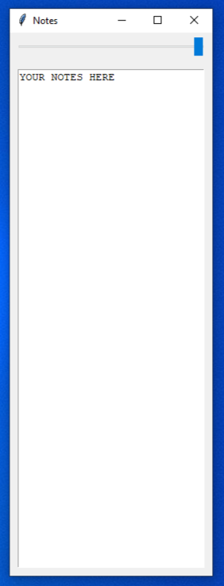

## Python pinned notes

### Why?
Need to keep notes visible while working? This app creates a small, floating notes window that stays on top of everything else, so you can browse or work without interruption.

### Details
- slider to change transparency of the window
- stores your notes in notes.txt
- stores the settings in settings.json (position of window, transparency)
- dark/light theme support ([@polienko](https://github.com/polienko))
- autosave notes every X seconds, setting available for change ([@polienko](https://github.com/polienko))

### Requirements
- **Python 3.x** - download from the [official Python website](https://www.python.org/downloads/)
- No additional libraries required

### License

This project is licensed under the GNU General Public License v3.0.  
See the [LICENSE](LICENSE) file for the full text.